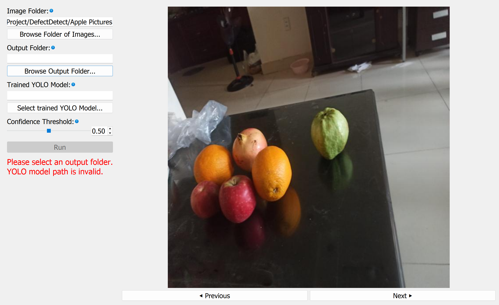

# YOLOEZ

A standalone, GUI based application for labeling data, training models, and running inference with Ultralytics powered YOLO11 models.  
This tool supports both bounding box detection and segmentation workflows and is designed to be usable without writing any code.

The application guides users through every step with built in tooltips, instructional popups, and clear workflow structure, making YOLO model training and usage accessible to users who may not be familiar with machine learning pipelines or Python development.

---

## Table of Contents

1. [Overview](#overview)
2. [Key Features](#key-features)
3. [System Requirements](#system-requirements)
4. [Supported Tasks](#supported-tasks)
5. [Getting Started](#getting-started)
6. [Application Workflow](#application-workflow)
7. [User Guidance and Help System](#user-guidance-and-help-system)
8. [Linux Remote Desktop Setup](#linux-remote-desktop-setup)
9. [Screenshots and Visual Examples](#screenshots-and-visual-examples)
10. [Repository Structure](#repository-structure)
11. [Intended Audience](#intended-audience)
12. [License](#license)

---

## Overview

This repository contains the full source code and prebuilt executables for a graphical application that simplifies the process of working with YOLOv8 models.

The tool provides an end to end workflow including:
- Dataset labeling
- Model training
- Model inference
- Visualization of results

All functionality is exposed through an intuitive graphical interface. No scripting or manual configuration is required.

---

## Key Features

- GUI driven YOLOv8 training and inference
- Support for bounding box detection and segmentation models
- Integrated dataset labeling tools
- Built in training configuration interface
- Step by step instructional popups
- Context sensitive tooltips throughout the interface
- No coding required
- Packaged executables for easy installation

---

## System Requirements

- Windows or Linux (When running on a headless Linux server, a remote desktop must be used to interact with the GUI, terminal commands are not consistent with the goal of this project).
   - Instructions for setting up remote desktop on a Linux server
- GPU recommended for training but not required
- Sufficient disk space for datasets and trained models

Exact requirements may vary depending on dataset size and model configuration.

---

## Supported Tasks

- Image annotation using bounding boxes
- Image annotation using segmentation masks
- Dataset organization
- Training YOLOv8 detection models
- Training YOLOv8 segmentation models
- Running inference on new images
- Visualizing predictions directly in the GUI

---

## Getting Started

No installation or environment setup is required.

1. Navigate to the **Releases** section of this repository, located on the right side of the GitHub page.
2. Download the latest release for your operating system.
3. Extract the downloaded zip file.
4. Launch the executable included in the extracted folder.
5. NOTE: You must keep the executable file in the same directory as the _internal folder.

The application will start immediately and guide you through the available workflows.

---

## Application Workflow

The application is organized into clear, sequential workflows:

1. **Labeling**
   - Load image datasets
   - Annotate images using built in tools
   - Save labels in YOLO compatible format

2. **Training**
   - Configure training parameters through the GUI
   - Start training with a single click
   - Monitor progress within the application

4. **Inference**
   - Load a trained model
   - Run predictions on new images
   - Save results both visually and in JSON format

Each stage includes guidance to help users understand what is required before moving forward.

---

## User Guidance and Help System

The GUI is designed to be self explanatory and instructional.

- Tooltips appear when hovering over blue question mark icons
- Instructional popups explain each step of a workflow
- Validation messages help prevent common mistakes
- Clear prompts guide users through required actions

This ensures that even first time users can successfully train and use YOLO models.

---

## Linux Remote Desktop Setup

This section explains how to set up a lightweight Linux remote desktop using **XFCE** and **TightVNC**, with minimal use of `sudo`. The desktop can be accessed from **Windows using RealVNC Viewer**. This allows for use of YOLOEZ on Linux-based headless GPU clusters.

### Requirements

- Linux machine (Debian/Ubuntu-based)
- Non-root user account
- Network or SSH access
- Windows machine for remote access

### 1. Install Required Packages on Linux machine (one-time sudo)

```bash
sudo apt update
sudo apt install -y xfce4 xfce4-goodies tightvncserver
````

Installed components:

* **xfce4** — lightweight desktop environment
* **xfce4-goodies** — additional XFCE utilities
* **tightvncserver** — VNC server


### 2. Initialize TightVNC (no sudo)

Run the VNC server once to set a password and create configuration files:

```bash
tightvncserver
```

After setup completes, stop the server:

```bash
tightvncserver -kill :1
```


### 3. Configure VNC to Start XFCE

Edit the VNC startup script:

```bash
nano ~/.vnc/xstartup
```

Replace the file contents with:

```sh
#!/bin/sh
unset SESSION_MANAGER
unset DBUS_SESSION_BUS_ADDRESS

exec startxfce4 &
```

Make the script executable:

```bash
chmod +x ~/.vnc/xstartup
```

### 4. Start the VNC Server (no sudo)

```bash
tightvncserver -geometry 1920x1080
```

Example output:

```
New 'X' desktop is hostname:1
```

This means:

* Display `:1`
* Port `5901`


### 5. Firewall Configuration (optional)

If you need direct access and a firewall is enabled:

```bash
sudo ufw allow 5901/tcp
```

### 6. Connect Securely Using SSH Tunnel

From Windows PowerShell:

```powershell
ssh -L 5901:localhost:5901 username@linux_host_ip
```

This forwards the VNC connection securely over SSH.


### 7. Install RealVNC Viewer on Windows

Download and install **RealVNC Viewer** (Viewer only):

* [https://www.realvnc.com/en/connect/download/viewer/](https://www.realvnc.com/en/connect/download/viewer/)


### 8. Connect from Windows

1. Open **RealVNC Viewer**
2. Enter the connection address:

     ```
     localhost:5901
     ```
     
3. Click **Connect**
4. Enter your VNC password

You should now see the XFCE desktop.


### 9. Managing VNC Sessions

List sessions:

```bash
tightvncserver -list
```

Stop a session:

```bash
tightvncserver -kill :1
```

Start a new session:

```bash
tightvncserver
```


### Notes

* Each display `:N` uses port `5900 + N`
* VNC passwords are separate from system passwords


## Screenshots and Visual Examples

### Main Application Window


### Bounding Box Annotation Example


### Segmentation Mask Example


### Tooltip Example


### Training Performance Panel


### Inference Preperation View


---

## Repository Structure
<pre>
├── src/                 # Application source code  
├── assets/              # Icons and UI assets  
├── docs/                # Documentation resources  
├── images/              # README images and screenshots  
├── compiler.py          # Script to automatically compile executable  
├── Various UV environment files  
└── README.md
</pre>

---

## Intended Audience

This tool is intended for:
- Researchers
- Students
- Engineers
- Domain experts without ML backgrounds
- Anyone who wants to train and use YOLOv8 models without writing code

---

## License

This project is licensed under the AGPL-3.0 License – see the [LICENSE](LICENSE) file for details.
