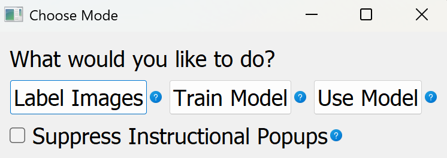
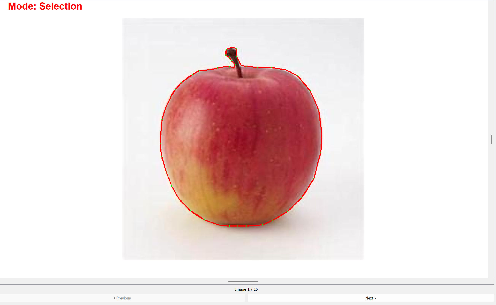
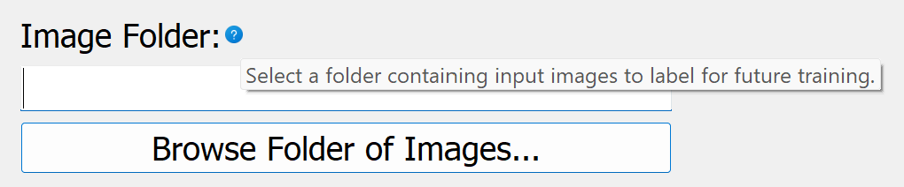
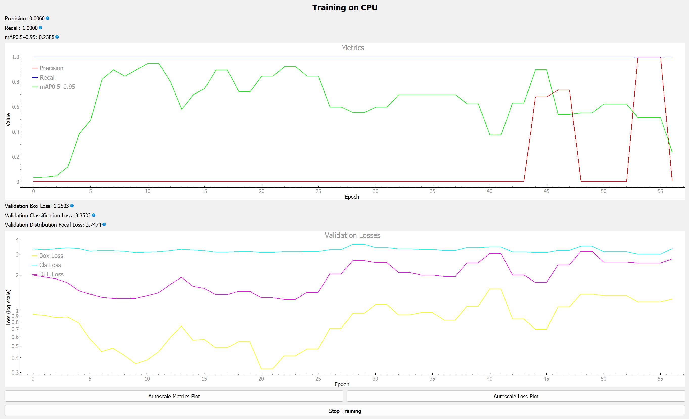

# YOLOv8 GUI Toolkit

A standalone, GUI based application for labeling data, training models, and running inference with Ultralytics powered YOLOv8 models.  
This tool supports both bounding box detection and segmentation workflows and is designed to be usable without writing any code.

The application guides users through every step with built in tooltips, instructional popups, and clear workflow structure, making YOLO model training and usage accessible to users who may not be familiar with machine learning pipelines or Python development.

---

## Table of Contents

1. [Overview](#overview)
2. [Key Features](#key-features)
3. [Supported Tasks](#supported-tasks)
4. [Getting Started](#getting-started)
5. [Application Workflow](#application-workflow)
6. [User Guidance and Help System](#user-guidance-and-help-system)
7. [Screenshots and Visual Examples](#screenshots-and-visual-examples)
8. [Repository Structure](#repository-structure)
9. [System Requirements](#system-requirements)
10. [Intended Audience](#intended-audience)
11. [License](#license)

---

## Overview

This repository contains the full source code and prebuilt executables for a graphical application that simplifies the process of working with YOLOv8 models.

The tool provides an end to end workflow including:
- Dataset labeling
- Model training
- Model inference
- Visualization of results

All functionality is exposed through an intuitive graphical interface. No scripting or manual configuration is required.

---

## Key Features

- GUI driven YOLOv8 training and inference
- Support for bounding box detection and segmentation models
- Integrated dataset labeling tools
- Built in training configuration interface
- Step by step instructional popups
- Context sensitive tooltips throughout the interface
- No coding required
- Packaged executables for easy installation

---

## Supported Tasks

- Image annotation using bounding boxes
- Image annotation using segmentation masks
- Dataset organization
- Training YOLOv8 detection models
- Training YOLOv8 segmentation models
- Running inference on new images
- Visualizing predictions directly in the GUI

---

## Getting Started

No installation or environment setup is required.

1. Navigate to the **Releases** section of this repository, located on the right side of the GitHub page.
2. Download the latest release for your operating system.
3. Extract the downloaded zip file.
4. Launch the executable included in the extracted folder.

The application will start immediately and guide you through the available workflows.

---

## Application Workflow

The application is organized into clear, sequential workflows:

1. **Labeling**
   - Load image datasets
   - Annotate images using built in tools
   - Save labels in YOLO compatible format

2. **Training**
   - Configure training parameters through the GUI
   - Start training with a single click
   - Monitor progress within the application

4. **Inference**
   - Load a trained model
   - Run predictions on new images
   - Save results both visually and in JSON format

Each stage includes guidance to help users understand what is required before moving forward.

---

## User Guidance and Help System

The GUI is designed to be self explanatory and instructional.

- Tooltips appear when hovering over blue question mark icons
- Instructional popups explain each step of a workflow
- Validation messages help prevent common mistakes
- Clear prompts guide users through required actions

This ensures that even first time users can successfully train and use YOLO models.

---

## Screenshots and Visual Examples

### Main Application Window

### Bounding Box Annotation Example

### Segmentation Mask Example

### Tooltip Example

### Training Performance Panel

### Inference Preperation View

---

## Repository Structure

.
├── src/ # Application source code
├── assets/ # Icons and UI assets
├── docs/ # Documentation resources
├── images/ # README images and screenshots
├── compiler.py # Script to automatically compile executable
├── Various UV environment files
└── README.md

---

## System Requirements

- Windows or Linux (When running on a Linux server, a remote desktop must be used to interact with the GUI, terminal commands are not consisten with the goal of this project).
- GPU recommended for training but not required
- Sufficient disk space for datasets and trained models

Exact requirements may vary depending on dataset size and model configuration.

---

## Intended Audience

This tool is intended for:
- Researchers
- Students
- Engineers
- Domain experts without ML backgrounds
- Anyone who wants to train and use YOLOv8 models without writing code

---

## License

This project is licensed under the MIT License – see the [LICENSE](LICENSE) file for details.
