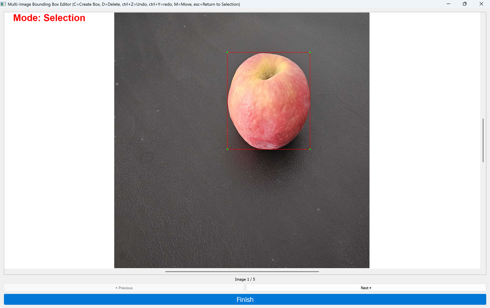
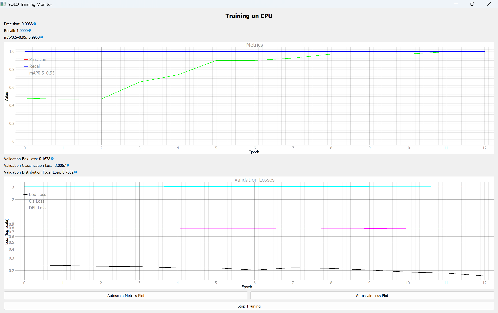
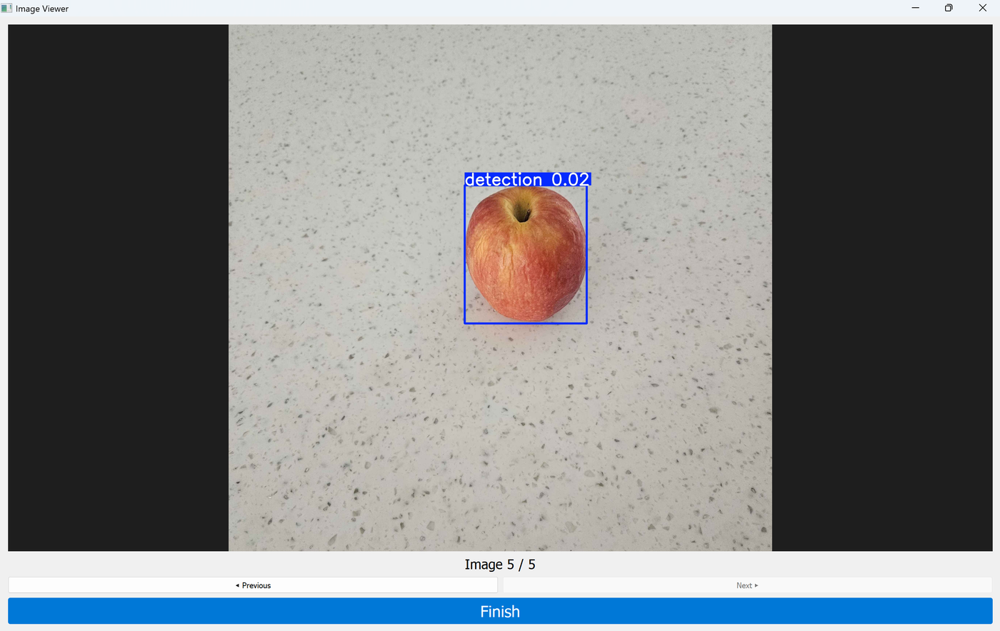
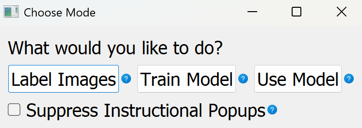
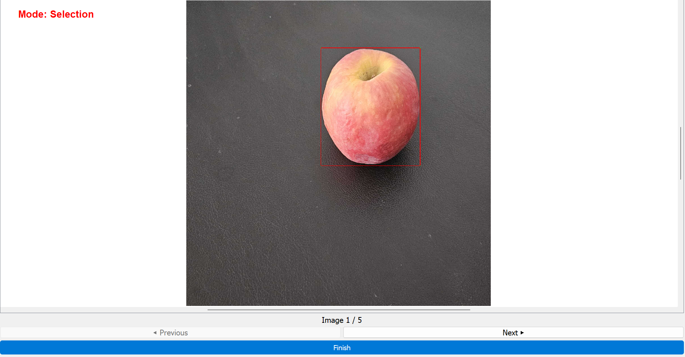
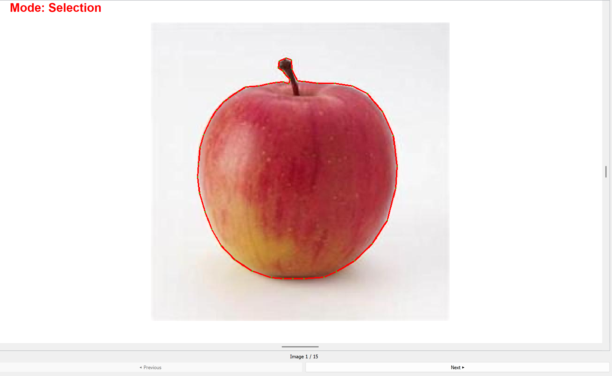
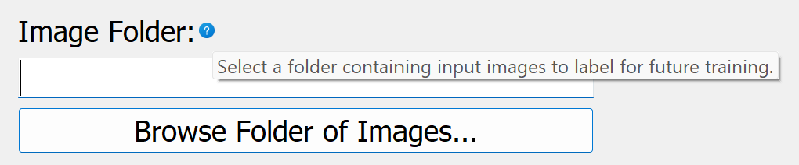
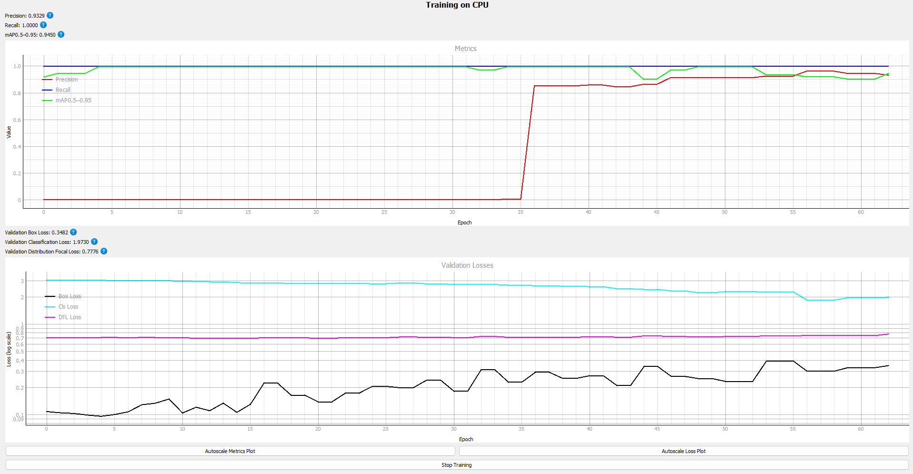
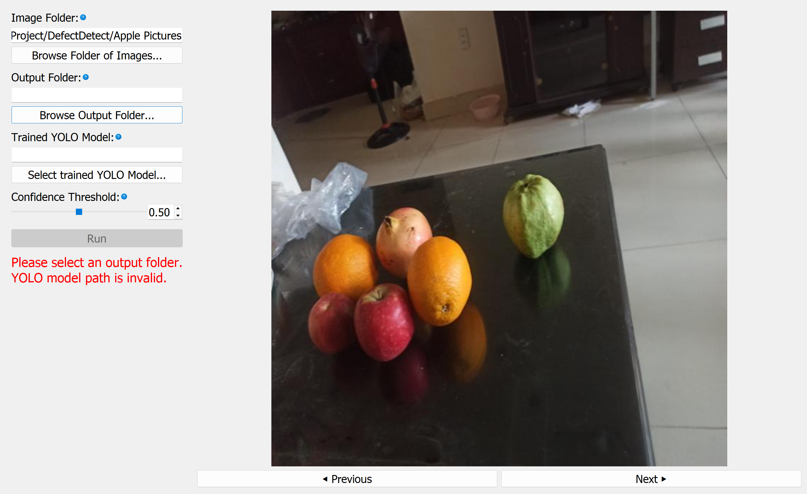

# YOLOEZ

**Main branch**  
[](https://github.com/michaelholm6/YOLOEZ/actions/workflows/test.yml?query=branch:main)

**Development branch**  
[](https://github.com/michaelholm6/YOLOEZ/actions/workflows/test.yml?query=branch:development)

A standalone, GUI based application for labeling computer vision data, training models, and running inference with Ultralytics powered YOLO11 models.  

This tool supports both bounding box detection and segmentation workflows and is designed to be usable without writing any code.

The application guides users through every step with built-in tooltips, instructional popups, and clear workflow structure, making YOLO model training and usage accessible to users who may not be familiar with machine learning pipelines or Python development.

---

## Table of Contents

1. [Overview](#overview)
2. [Key Features](#key-features)
3. [System Requirements](#system-requirements)
4. [Supported Tasks](#supported-tasks)
5. [Getting Started](#getting-started)
6. [Running from Source](#running-from-source)
7. [Quick Start Example](#quick-start-example)
8. [Testing](#testing)
9. [Application Workflow](#application-workflow)
10. [User Guidance and Help System](#user-guidance-and-help-system)
11. [Linux Remote Desktop Setup](#linux-remote-desktop-setup)
12. [Screenshots and Visual Examples](#screenshots-and-visual-examples)
13. [Repository Structure](#repository-structure)
14. [Intended Audience](#intended-audience)
15. [License](#license)

---

## Overview

This repository contains the full source code and prebuilt executables for a graphical application that simplifies the process of working with YOLO11 models.

The tool provides an end-to-end workflow including:
- Dataset labeling
- Model training
- Model inference
- Visualization of results

All functionality is exposed through an intuitive graphical interface. No scripting or manual configuration is required.

---

## Key Features

- GUI driven YOLO11 training and inference
- Support for bounding box detection and segmentation models
- Integrated dataset labeling tools
- built-in training configuration interface
- Step by step instructional popups
- Context sensitive tooltips throughout the interface
- No coding required
- Packaged executables for easy installation

---

## System Requirements

- Windows or Linux (When running on a headless Linux server, a remote desktop must be used to interact with the GUI; terminal commands are outside the intended workflow.).
   - [Instructions for setting up remote desktop on a Linux server](#linux-remote-desktop-setup)
- GPU recommended for training but not required
- Sufficient disk space for datasets and trained models

Exact requirements may vary depending on dataset size and model configuration.

---

## Supported Tasks

- Image annotation using bounding boxes
- Image annotation using segmentation masks
- Dataset organization
- Training YOLO11 detection models
- Training YOLO11 segmentation models
- Running inference on new images
- Visualizing predictions directly in the GUI

---

## Getting Started

No installation or environment setup is required. 

(NOTE: If you're trying to run this on a linux remote desktop, reference [this section](#linux-remote-desktop-setup).)

1. Navigate to the [**Releases**](https://github.com/michaelholm6/YOLOEZ/releases) section of this repository, located on the right side of the GitHub page.
2. Download the latest release for your operating system. If downloading for Linux, download all numbered zip files.
   NOTE: If downloading for Linux, refer to [this section](#6-combine-the-split-zip-files-into-a-single-zip) for guidance on combining multiple zip files.
3. Extract the downloaded zip file.
4. Launch the executable included in the extracted folder.
5. NOTE: You must keep the executable file in the same directory as the _internal folder.

The application will start immediately and guide you through the available workflows.

---

## Running from Source

Most users should use the prebuilt executables described above. Running from source is intended for anyone who wants to use the latest development code, modify YOLOEZ, or review the project.

**Requirements:** Python 3.12 or newer, `git`, and a graphical display.

```bash
# 1. Clone the repository
git clone https://github.com/michaelholm6/YOLOEZ.git
cd YOLOEZ

# 2. (Recommended) create and activate a virtual environment
python -m venv .venv
source .venv/bin/activate      # Linux / macOS
.venv\Scripts\activate      # Windows

# 3. Install YOLOEZ and its dependencies
pip install -e ".[dev]"

# 4. Launch the application
python src/main.py
```

This installs the runtime dependencies along with PyQt5 and the development tools. PyQt5 is listed under the `[dev]` extra rather than as a core dependency because it cannot be installed by UV; installing with `pip`, as shown above, works correctly.

The first training or inference run will download the relevant pretrained YOLO11 weights automatically, so an internet connection is needed the first time.

YOLOEZ is a graphical application and requires a display. To run it on a headless Linux machine, see [Linux Remote Desktop Setup](#linux-remote-desktop-setup).

---

## Quick Start Example

This example walks through one complete label → train → infer cycle using the five sample images bundled in [`assets/test_images/`](assets/test_images), each showing a single apple photographed against a dark background. It is deliberately small: the goal is to confirm YOLOEZ works end to end on your machine and to show the shape of the workflow, not to produce a useful model.

Every step below is also explained by instructional popups inside the application, so you do not need to keep this page open while you work.

**What you will produce:** a bounding box detector for a single class, trained on five images.

> **This example is a tour of the interface. It is not a demonstration that YOLOEZ produces good models, and should not be read as one.**
>
> Treated as evidence of effectiveness it would be a poor study, deliberately so — it is built to run in a few minutes on any machine, not to be valid:
>
> - **Five training images**, orders of magnitude fewer than a detection task normally needs.
> - **No held-out test set.** Step 3 runs inference on the same images the model was trained on.
> - **A validation set of one.** An 80/20 split of five images leaves a single image for validation, so every metric reported during training is noise.
> - **Degenerate validation numbers.** The run reaches recall 1.0 at precision 0.003, which is what a model that fires indiscriminately looks like.
> - **An unusable confidence threshold.** Step 3 needs 0.02 to show anything at all, far below what you would deploy.
>
> None of these are limitations of YOLOEZ; they are consequences of shrinking a real workflow down to something you can finish in one sitting. For evidence that YOLOEZ trains models that hold up, see [Applying this to your own data](#applying-this-to-your-own-data) at the end of this section.

---

### Step 1 — Label the images

1. Launch YOLOEZ and click **Label Images** on the "What would you like to do?" dialog.
2. Click **Browse Folder of Images...** and select `assets/test_images/`. The images appear in the preview pane; use **◀ Previous** and **Next ▶** to page through them.
3. For the annotation mode, select **Bounding Boxes**.
4. Tick **Save YOLO Training Sample** so the run writes a YOLO-format dataset.
5. Click **Browse Output Folder...** and choose where results should go.
6. Click **Run**.
7. **Area of interest:** you will be asked to outline the regions worth labeling. For this example you can skip it — leaving an image unmarked uses the whole image.
8. **Bounding box editor:** press `C`, then click and drag a box around the apple. Repeat for each image and close the window when finished.



Your output folder now contains:

<pre>
output_folder/
├── box_visualizations/   # PNGs showing the boxes drawn on each image
└── yolo_dataset/         # The training dataset: one .png and one .txt per image
</pre>

Each `.txt` holds one line per object in YOLO format, as `class x_center y_center width height`, normalized to a 0–1 range:

```
0 0.606152 0.347836 0.323312 0.382597
```

A reference copy of this output ships in [`assets/test_labels/`](assets/test_labels) if you want to compare against it.

---

### Step 2 — Train a model

1. Return to the start dialog and click **Train Model**.
2. Click **Browse Training Dataset...** and select the `yolo_dataset/` folder from Step 1. YOLOEZ infers automatically from the label format that this is a detection dataset rather than a segmentation one.
3. Choose a model size. **Nano** trains fastest and is the right choice here.
4. Under **Apply Data Augmentations**, tick all five available options — **Flip**, **Color Jitter**, **Blur**, **Noise**, and **Scale** — and set **Augmentations per image** to `3`. **Rotate** is hidden automatically, because rotating an image would invalidate its axis-aligned bounding boxes.
5. Leave **Train/Test Split (% for training)** at its default of 80.
6. Click **Browse Save Directory...** to choose where the trained `.pt` file is written, then click **Run**.

YOLOEZ does not ask you for a number of epochs. Training runs continuously and you decide when to stop it: watch the live metric and loss plots, and click **Stop Training** once the curves have flattened out. The best-performing weights are what get saved, so stopping later than necessary costs time but not accuracy.

The panel header shows whether the run is using your **GPU** or falling back to **CPU**. On this five-image dataset, a Nano model on CPU trains fast enough that the plots update every few seconds — the run shown below was stopped after about a dozen epochs.



> **Note:** the metrics above illustrate the caveat at the top of this section. Recall reaches 1.0 while precision sits near 0.003, meaning the model predicts boxes almost everywhere rather than telling apples from background. The near-perfect mAP reflects how trivially separable a single large apple on a plain surface is, and is measured against a validation set of one image. These are the numbers a five-image dataset produces, not the numbers YOLOEZ produces.

---

### Step 3 — Run inference

1. Return to the start dialog and click **Use Model**.
2. Click **Select trained YOLO Model...** and choose the `.pt` file saved in Step 2.
3. Click **Browse Folder of Images...** and select `assets/test_images/` again. These are the same images the model trained on, so the detections below show only that the pipeline runs end to end — they are not a measure of accuracy.
4. Set the **Confidence Threshold** to `0.02`. This is far lower than you would use in practice; a model trained on five images produces weak, low-confidence predictions, so a normal threshold would filter everything out.
5. Click **Browse Output Folder...**, then click **Run**.

Results open in a built-in viewer before being saved. The output folder receives the annotated images alongside a JSON file per image describing each detection.



---

### Applying this to your own data

The same three steps apply to any image set: point Step 1 at your own folder instead of `assets/test_images/`. Real datasets need considerably more than five images — but likely fewer than you would expect. In a published structural health monitoring study, YOLOEZ was used to train a segmentation model on 20 labeled electron microscope images that outperformed a classical morphological baseline tuned across 780 parameter combinations, measured by recall, F1 score, and IoU ([Holm et al., SMASIS 2026](https://arxiv.org/abs/2608.25176)).

---

## Testing

YOLOEZ includes an automated test suite built with `pytest` and `pytest-qt` that exercises all three workflows end to end against a small bundled dataset, without requiring a visible display.

After installing from source as described above, run the full suite from the repository root:

```bash
pytest
```

On a headless Linux machine, the Qt tests need an offscreen platform plugin and a virtual display:

```bash
QT_QPA_PLATFORM=offscreen xvfb-run -a python -m pytest
```

Other useful commands:

```bash
# Run a single test
pytest tests/test_cases.py::test_name -v

# Run the suite with a coverage report
python -m pytest --cov=src --cov-report=xml

# Check formatting the way CI does
black --check .
```

The same suite runs automatically in continuous integration on both Ubuntu and Windows (Python 3.12) for every push and pull request to `main` and `development`, together with a Black formatting check. Current status is shown by the badges at the top of this README.

---

## Application Workflow

The application is organized into clear, sequential workflows:

1. **Labeling**
   - Load image datasets
   - Annotate images using built-in tools
   - Save labels in YOLO compatible format

2. **Training**
   - Configure training parameters through the GUI
   - Start training with a single click
   - Monitor progress within the application

3. **Inference**
   - Load a trained model
   - Run predictions on new images
   - Save results both visually and in JSON format

Each stage includes guidance to help users understand what is required before moving forward.

---

## User Guidance and Help System

The GUI is designed to be self-explanatory and instructional.

- Tooltips appear when hovering over blue question mark icons
- Instructional popups explain each step of a workflow
- Validation messages help prevent common mistakes
- Clear prompts guide users through required actions

This ensures that even first time users can successfully train and use YOLO models.

---

## Linux Remote Desktop Setup

This section explains how to set up a lightweight Linux remote desktop using **XFCE** and **TightVNC**, with minimal use of `sudo`. The desktop can be accessed from **Windows using RealVNC Viewer**. This allows for use of YOLOEZ on Linux-based headless GPU clusters.

### Requirements

- Linux machine (Debian/Ubuntu-based)
- Non-root user account
- Network or SSH access
- Windows machine for remote access

### 1. Install Required Packages on Linux machine

```bash
sudo apt update
sudo apt install -y xfce4 xfce4-goodies tightvncserver unzip
```

Installed components:

* **xfce4** — lightweight desktop environment
* **xfce4-goodies** — additional XFCE utilities
* **tightvncserver** — VNC server
* **unzip** — utility to extract zip files

### 2. Download all parts from the [releases page](https://github.com/michaelholm6/YOLOEZ/releases) to your **local Windows machine** for your specific architecture. If you're not sure which files you need, you probably need the ones title YOLOEZ-linux-x86_64.zip.001, YOLOEZ-linux-x86_64.zip.002, etc.

### 3. Copy the files to your Linux server using `scp` (or WinSCP):

```powershell
scp path/to/YOLOEZ-linux-x86_64.zip.* username@linux_host_ip:/home/username/
```

> Replace `username` and `linux_host_ip` with your Linux credentials. Replace ```path/to/``` with the path that you downloaded the individual zip files to.

### 4. SSH into the Linux server:

```bash
ssh username@linux_host_ip
```

### 5. Navigate to the folder containing the split ZIPs:

```bash
cd /home/username
```

### 6. Combine the split ZIP files into a single ZIP:

```bash
cat YOLOEZ-linux-x86_64.zip.* > YOLOEZ-linux-x86_64.zip
```

> `cat` concatenates the numeric parts in order (`.001`, `.002`, …). Make sure they are named sequentially.

### 7. Extract the combined ZIP:

```bash
unzip YOLOEZ-linux-x86_64.zip
```

### 8. Make the YOLOEZ executable runnable:

```bash
chmod +x YOLOEZ
```

### 9. Initialize TightVNC

Run the VNC server once to set a password and create configuration files:

```bash
tightvncserver
```

After setup completes, stop the server:

```bash
tightvncserver -kill :1
```

### 10. Configure VNC to Start XFCE

```bash
nano ~/.vnc/xstartup
```

Replace contents with:

```sh
#!/bin/sh
unset SESSION_MANAGER
unset DBUS_SESSION_BUS_ADDRESS

exec startxfce4 &
```

Make executable:

```bash
chmod +x ~/.vnc/xstartup
```

### 11. Start the VNC Server

```bash
tightvncserver -geometry 1920x1080
```

Example output:

```
New 'X' desktop is hostname:1
```

This means:

* Display `:1`
* Port `5901`


### 12. Firewall Configuration (optional)

If you need direct access and a firewall is enabled:

```bash
sudo ufw allow 5901/tcp
```

### 13. Connect Securely Using SSH Tunnel

From Windows PowerShell:

```powershell
ssh -L 5901:localhost:5901 username@linux_host_ip
```

This forwards the VNC connection securely over SSH.


### 14. Install RealVNC Viewer on Windows

Download and install **RealVNC Viewer** (Viewer only):

* [https://www.realvnc.com/en/connect/download/viewer/](https://www.realvnc.com/en/connect/download/viewer/)


### 15. Connect from Windows

1. Open **RealVNC Viewer**
2. Enter the connection address:

     ```
     localhost:5901
     ```
     
3. Click **Connect**
4. Enter your VNC password

You should now see the XFCE desktop.

### 16. Open Executable

1. In the remote desktop viewer, navigate to /home/username
2. Find the unzipped executable, and run it
3. The tool will now guide you through using it


### 17. Managing VNC Sessions

Stop a session:

```bash
tightvncserver -kill :1 (or :2, :3, etc. depending on how many sessions you're running)
```


### Notes

* Each display `:N` uses port `5900 + N`
* VNC passwords are separate from system passwords


## Screenshots and Visual Examples

### Main Application Window


### Bounding Box Annotation Example


### Segmentation Mask Example


### Tooltip Example


### Training Performance Panel


### Inference Preparation View


---

## Repository Structure
<pre>
├── src/                 # Application source code  
├── assets/              # Icons and UI assets  
├── tests/               # Test cases for ensuring code quality
├── images/              # README images and screenshots      
├── AUTHORS.md           # File containing list of YOLOEZ authors
├── CITATION.cff         # Machine-readable citation metadata for this software
├── CODE_OF_CONDUCT.md   # File explaining how people are expected to act in this repo
├── CONTRIBUTING.md      # File explaining the process of contributing code to this project
├── LICENSE              # License file explaining how this code may be used
├── README.md            # File explaining this project
├── paper.md             # Software paper describing YOLOEZ
├── paper.bib            # Bibliography for the software paper
└── Various UV environment files
   
</pre>

---

## Intended Audience

This tool is intended for:
- Researchers
- Students
- Engineers
- Domain experts without ML backgrounds
- Anyone who wants to train and use YOLO11 models without writing code

---

## License

This project is licensed under the AGPL-3.0 License – see the [LICENSE](LICENSE) file for details.
