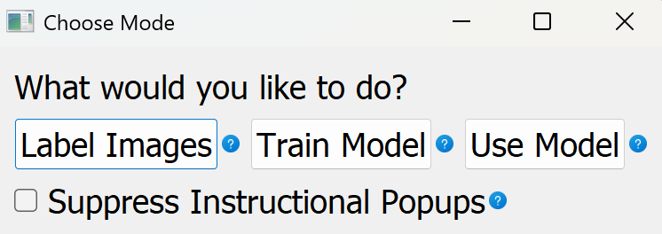
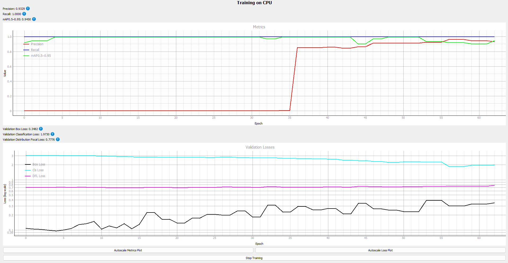

# Summary

YOLOEZ is an open-source, cross-platform desktop application that provides a complete, no-code pipeline for developing and deploying YOLO11 [@ultralytics2023] computer vision models. The application guides users through three sequential workflows: dataset labeling, model training, and inference. All functionality is exposed through a graphical interface built with PyQt5, eliminating the need for command-line interaction or Python programming. YOLOEZ supports both bounding box object detection and polygon-based instance segmentation tasks, and is distributed as a standalone executable for Windows and Linux that requires no Python installation.

# Statement of Need

State-of-the-art object detection and segmentation models have become accessible to the broader research community through frameworks such as Ultralytics YOLO [@ultralytics2023], yet the practical barrier to using these tools remains high for domain experts without programming backgrounds. A concrete example motivates this work: materials scientists performing structural health monitoring routinely detect cracks in images using classical morphological image processing methods [TSAI2019209], not because those methods are superior, but because training a deep learning model requires Python proficiency, familiarity with dataset formats, and knowledge of training configuration that most domain practitioners do not have. YOLOEZ was developed to address this gap directly: a researcher with image data and domain knowledge should be able to train and deploy a state-of-the-art detection or segmentation model without writing a single line of code.

More broadly, biologists, medical researchers, engineers, and other domain experts with labeled or unlabeled image data face the same barrier. Existing tools address only parts of this problem. Annotation tools such as CVAT [@cvat2022] and Label Studio [@labelstudio2020] cover the labeling step but provide no path to model training or inference. Cloud-based platforms such as Roboflow [@dwyer2026roboflow] and Ultralytics HUB [@jocher2023ultralytics] provide end-to-end graphical pipelines but require data to be uploaded to external servers, which is unacceptable for sensitive, proprietary, or patient-related research data. The Ultralytics Python API and CLI require programming proficiency and explicit manual dataset management. None of these options provides a fully local, no-code, end-to-end workflow on the researcher's own hardware.

# State of the Field

The tools most relevant to YOLOEZ span three categories:

**Annotation-only tools:** LabelMe [@wada2024labelme] and CVAT [@cvat2022] support YOLO-format export but offer no training or inference. Label Studio [@labelstudio2020] provides broader ML backend integration but requires a running server and configuration expertise.

**Cloud platforms:** Roboflow and Ultralytics HUB offer end-to-end pipelines with graphical interfaces but are cloud-hosted, require account registration, and transmit data to external services, making them unsuitable for sensitive or proprietary research data; Roboflow's model training is additionally restricted to a paid subscription tier. Browser-based tools such as Google Teachable Machine [@teachablemachine] and Microsoft Custom Vision [@customvision] provide no-code interfaces but support only image classification, lacking the object detection and instance segmentation capabilities required for precise defect localization.

**CLI and scripting tools:** The Ultralytics Python package and CLI provide complete programmatic control over YOLO11 but require Python proficiency, manual YAML configuration, and explicit dataset directory preparation.

YOLOEZ covers the entire pipeline (labeling, training, and inference) locally, without configuration files, command-line interaction, or account registration. For domain researchers whose data cannot leave local infrastructure and who lack software engineering support, no existing tool provides this combination.

# Software Design

YOLOEZ is organized around three independent workflows, each implemented as a separate package and accessible through a top-level choice dialog (\autoref{fig:main}).

**Labeling workflow:** Users select a folder of images and optionally provide a pre-trained YOLO model for bootstrap annotation, where the model generates an initial set of annotations that the user then corrects rather than creating all labels from scratch. An area-of-interest tool using polygon masking allows irrelevant image regions to be excluded before annotation begins, reducing the labeling burden for images with large uniform backgrounds. Users then refine bounding boxes or polygon contours in interactive editors built on `QGraphicsView`, with undo/redo, lasso selection, and zoom. Labels are saved in YOLO format alongside the source images.

**Training workflow:** Users select a labeled dataset, choose a model size (nano through extra-large), configure data augmentation via checkboxes, and set a train/validation split (\autoref{fig:training}). The dataset task type (detection or segmentation) is automatically inferred from label file structure, removing a common source of configuration error. Training is executed via the Ultralytics API [@ultralytics2023] in a background thread, with live loss and metric plots rendered using PyQtGraph. Augmentation uses the Albumentations library [@buslaev2020], with coordinate transforms applied consistently to both images and their labels.

**Inference workflow:** Users load a trained `.pt` model and a folder of images, optionally crop to areas of interest, run inference, and browse results in a built-in viewer before saving annotated images and structured JSON output.

## Design decisions

The design of YOLOEZ reflects deliberate trade-offs in favor of accessibility over flexibility, each motivated by the target audience of non-programmers.

**Pre-trained architectures only.** YOLOEZ restricts users to the standard Ultralytics YOLO11 model family (nano through extra-large) and does not expose custom architecture definition. Allowing users to modify network architecture would require understanding of layer types, parameter counts, and GPU memory constraints, which are outside the scope of the intended user. The five size variants cover the full practical range from edge-deployable to high-accuracy configurations.

**No remote training.** YOLOEZ runs training only on the local machine and does not support submitting jobs to a remote GPU server. Configuring SSH credentials, remote paths, and job schedulers inside a GUI would significantly increase interface complexity for a capability that most target users do not need and that the tool's data-privacy motivation already argues against.

**Restricted input file types.** Accepted image formats are limited to JPEG, PNG, BMP, and TIFF variants. While this excludes some scientific image formats, it ensures reliable behavior across the label-train-infer pipeline and avoids format-specific edge cases that would be opaque to non-technical users.

**Automatic task detection.** Rather than asking users to specify whether their dataset is a detection or segmentation dataset, YOLOEZ infers this from the coordinate count in label files (four values per annotation indicates bounding boxes; more indicates polygon vertices). This eliminates a common misconfiguration error.

**Rotation augmentation disabled for detection.** YOLO detection labels encode axis-aligned bounding boxes. Applying arbitrary rotation augmentation to detection data would produce labels that no longer accurately bound the rotated objects, so the rotation option is automatically disabled and hidden when a detection dataset is loaded.

# Research Impact Statement

YOLOEZ was developed at Purdue University and has been applied directly in structural health monitoring research. A study accepted for publication at the ASME Conference on Smart Materials, Adaptive Structures and Intelligent Systems (SMASIS) [@holm2026smasis] used YOLOEZ to train a YOLO11 segmentation model for detecting micro-scale cracks in scanning electron microscope images of additively manufactured tungsten. Evaluated against a classical morphological baseline tuned across 780 parameter combinations, the YOLOEZ-trained model outperformed it in recall (0.61 vs. 0.44), F1 score (0.56 vs. 0.54), and IoU (0.42 vs. 0.40), with results validated across ten independent training runs and tested on an out-of-distribution sample from a separate tungsten specimen. This performance was achieved with only 20 labeled training images, a dataset size typical of SHM research, demonstrating that domain researchers can achieve competitive deep learning results without programming expertise. This is precisely the gap YOLOEZ targets: materials scientists default to morphological methods not because they are superior, but because no accessible path to training a deep learning model previously existed.

# Open-Source Software Practices

YOLOEZ follows established open-source software practices throughout its development. The project includes a 980-line test suite using pytest and pytest-qt that exercises all three workflows against a synthetic dataset in headless mode. Continuous integration runs on both Ubuntu and Windows (Python 3.12) via GitHub Actions, enforcing Black code formatting and generating coverage reports on every push to the main and development branches. The repository includes CONTRIBUTING.md with a documented contribution workflow, CODE_OF_CONDUCT.md, and a GitHub issue tracker with labeled categories for bugs and feature requests. The software has been under public development since August 2025, with five pre-release versions and an issue-driven development history. It is licensed under AGPL-3.0.

# AI Usage Disclosure

Generative AI tools were used in two areas of this work:

- **Code:** GitHub Copilot (latest version at time of development) was used for inline code completion assistance during software development. All generated suggestions were reviewed, tested, and validated by the author before inclusion.

- **Paper and documentation:** Claude (Anthropic, claude-sonnet-4-6) was used to assist with drafting paper text and writing source code docstrings. All AI-assisted text was reviewed and edited by the author.

The author made all core design decisions, defined the problem framing and architecture, validated all AI-assisted outputs, and takes full responsibility for the accuracy and integrity of the submitted work.

# Acknowledgements

Development was supported by Purdue University. The author thanks the Ultralytics team for their open-source YOLO11 implementation.

# References
